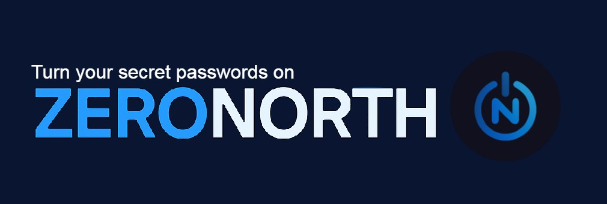

  

<h1 align="center">Zero North Vault</h1>

  Your personal 1-of-1 cipher engine. An offline cryptographic artifact, inspired by blockchain.

---

> **TL;DR**:
> If you're a random user: This is a secret encryption environment.
> For judges and cryptographers, Zero North Vault is a 1-of-1 unique cryptographic encryption environment that functions like an actual digital artifact, your own personal encryption language.

> **zkVault generates a 1-of-1 offline `.exe` encryption UI that can only encrypt/decrypt *your* information.**

> No sync. No cloud. No verifier.  
> Just you, your passphrases, and a proof-sealed cryptographic object.
> Your own vault. Your own encryption. Your own language. Forever. 

### 🧬 What is it?

**For Consumers**:  
Zero North Vault (*zkVault*) is your personal secret passcode generator.  
**ONLY you** own the `.exe` and the encryption logic. Store it locally. Use it offline.

- Pick a key word to use as the password for your string of text (infinite combinations), encrypt. Enter the same key word and string and decrypt.
- Each `.exe` is **cryptographically distinct**. It is **uncrackable** using other user's vaults, unless theirs are identical builds.  
- The only way to decrypt what it encrypts is through owning the machine output (.exe seeded program) itself.

**Zero North Vault (zkVault)** is a dark-mode, black-box, air-gapped, artifact-bound symmetric encryption app. 

Each vault:
- Is cryptographically unique  
- Can’t decrypt any other vault’s data  
- Includes a zk-style `vaultproof.json` (for proof of individuality)

Good for:  
Keeping your own personal encryption language on a USB stick.  
Encrypting data in a country where you're compromised, and decrypting it with a backup on your desktop at home.  
A language only you (or a loved one you shared the program with) can ever speak.  

**Nobody can recover your vault. You don’t own an account. There is no sync. No recovery. You are interacting with a physical cryptographic object.**

---

### 🔐 How it works

Every `.exe` is generated with:

- A high-entropy cryptographic seed  
- Custom AES runtime logic
- A static genesis timestamp (`vault-genesis.txt`)  
- A SHA-256 logic fingerprint (`vaultproof.json`)  

You receive:
- A .zip that packs up your encryption `.exe`  
- A proof-of-build artifact  
- A unique cipher engine that runs fully offline

---

### 🧠 Isn’t this just a toy?

No.  
It’s actually a cryptographic object.

You’re not storing secrets.  
You’re generating a cipher language that only you can speak.

> 🔻 You don’t store secrets in the cloud.  
> 🔺 Zero North _generates_ an entire universe for your secrets, with localized physics.

Zero North Vault flips the security model and gives you the tools to protect yourself.

### Lose the `.exe`, and no one — not even you — can recover the data.  
### That’s the point.

---

### 🛠 Usage

This repo contains the **frontend only, sorry.**.

To use the full system:
1. Visit my Devpost website (currently keeping hidden because I think my droplet would blow up) 
2. Fetch your vault with my API and I'll generate you an encryption environment
3. Encode or decode strings using your `.exe`  
4. Optionally verify build authenticity using `verifyProof.js`  
5. Profit?

---

### Note to fellow zk or cryptography nerds like me: 

Yes, there’s a proof file.
No, this isn't a consensus artifact. Yes, you can read **yours**. 
The idea was an applied 'genesis block' style framework injected into the actual runtime logic of each cryptographic environment.

To verify:
Move verifyProof.js into your /vaultproof/ directory and run it via
node verifyProof.js

It confirms the artifact's logic fingerprint, timestamp, and seed integrity.

This is a straight up spy tool, kind of.
Don't be a nerd. Admit it, this is cool. 

**This isn’t about public consensus or zk verification. It’s about information ownership and putting easy to use tools in human hands.**

**This is the real deal. Tell that VC to go decrypt this: b4e44884ab88c27e7cf8db3b86bae7ba.9fa1... (They won’t. You will. That’s the point.)  Say what you need bro, get it out. Delete it after. Spin up another vault.**

---

### 🔒 Ownership & Status

- Created by [**0north.eth**](https://github.com/0north-eth)  
- Built for the **Bolt Prompt Generation Hackathon**  
- **Patent Pending**  
- **Frontend is source-visible** (Apache 2.0)  
- **Encryption backend is closed-source and proprietary**

> _zkVault is a cryptographic object; a logic-item built from your intent and sealed in time._

---

### 🧾 License

This frontend is licensed under [Apache 2.0](LICENSE.md).  
Backend logic is proprietary and not included in this repository.

---

### 🧬 Credits

Crafted by [**0north.eth**](https://github.com/0north-eth)  
Strategic advisor for zk-gaming systems, $40k to charity, researching cryptography.
---

> _"Blue lightsabers."_ 💙
> — 0north

